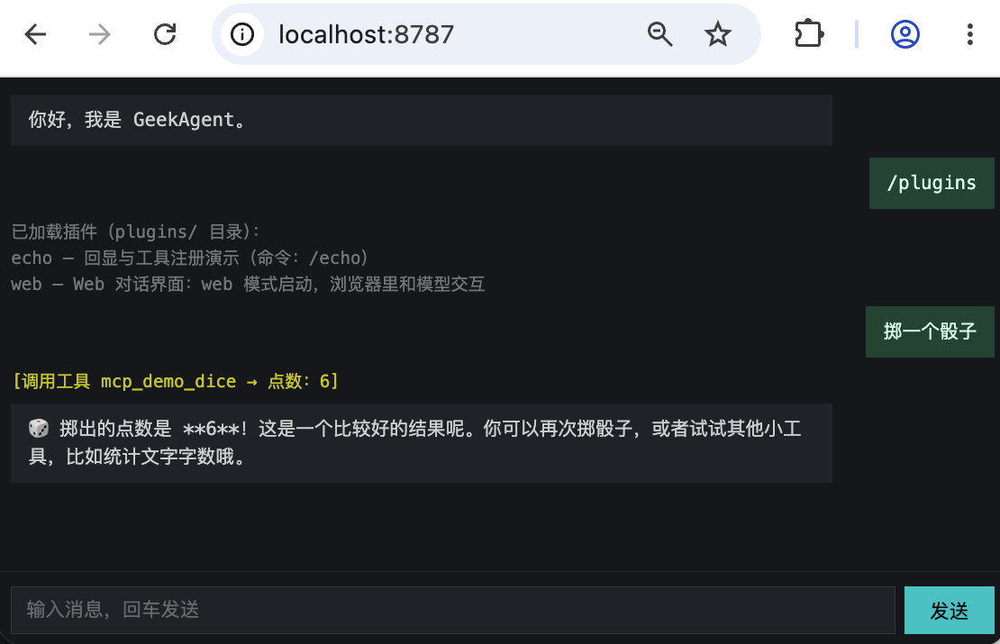

# Day 16: The Plugin Framework — Plug and Play with the plugins/ Directory

> Day 15 could already discover MCP tools dynamically, but starting and cleaning up Skills, RAG, and MCP is still wired into the main program item by item. Today we add a plugin convention: the main program only discovers and dispatches, while extension capabilities declare their own commands, tools, and lifecycle.

## 0. How Are Plugins Different from the Capabilities We Already Have?

Since Day 11 we have added Skills, MCP tools, and the RAG knowledge base one by one, each living in its own module file. But how are they different from a "plugin"?

| Aspect | Skills / MCP / RAG | Plugins |
|---|---|---|
| How it's loaded | The main program imports and calls it explicitly | Scan the plugins/ directory, load dynamically and automatically |
| How it registers | Calls `registerTool` directly | Gets a context through the `onStart` hook |
| Can it run a service | No, all code lives in the main process | Yes, `onStart` can freely start an HTTP server |
| Can it evolve independently | Changes require re-adjusting the main program's wiring | As long as the SDK contract holds, the directory content can change on its own |
| Failure impact | A code mistake can crash the main program | A load failure or a hook error rolls back only that plugin |
| Coupling with the main program | Tight — imports are explicit | Loose — depends only on the SDK interface |

Skills organize instructions and tools by task, MCP connects external processes over a protocol, and RAG manages searchable material. Plugins don't replace them; they solve another layer of the problem: how a bundle of code gets discovered by the main program, how it obtains its runtime environment, and how it releases resources on exit.

A plugin is also not "a thing that can only register tools". It can register commands (the echo plugin's `/echo`) and start services (the web plugin serves HTTP on port 8787). Registering tools is just one of the things `onStart` can do.

## 1. Why: Every New Feature Meant Touching the Main Program

For the first 15 days, each new capability meant opening `index.ts`: add an import and an initialization call, then add a case to `handleCommand`. The capabilities were already split into files, but the wiring stayed concentrated in the entry point.

Pulling capabilities out of the main program into standalone modules brings several immediate benefits:

- **A stable entry point**. Adding a plugin adds one directory — no more new imports, initialization calls, or command cases for it.
- **Failure isolation**. When a plugin fails to load or start, the framework records the error and rolls back the commands and tools it registered, while other plugins keep starting.
- **A uniform lifecycle**. Plugins acquire dependencies in `onStart` and release resources such as HTTP servers in `onExit`; the main program only calls them in order.

This is not refactoring all the old modules into plugins. Day 16 first establishes the minimal contract, then validates the three extension points — commands, tools, and services — with the echo and web directories.

## 2. Goals

1. At startup the program scans `plugins/*/plugin.ts`: valid plugins enter the list, and plugin commands run directly as `/command`;
2. `onStart` can register model tools or start a service; on failure only the current plugin is rolled back, and the other plugins stay usable;
3. When started in `web` service mode, browser messages reuse the main program's existing command dispatch, memory recall, and tool loop, with results streamed back over SSE.

**Lines of code for the day**: compared with Day 15, the source gains 420 lines and loses 9 — a net gain of 411; among them `plugins/web/index.html` (73 lines) is the browser-side chat page, and `tui.ts` is identical to Day 15.

## 3. Design: A Plugin = A Directory + plugin.ts

### 3.1 Where Can Plugins Run?

Plugins in mature systems come in roughly three forms:

| Approach | How it integrates | Isolation | Main cost | Suited for |
|---|---|---|---|---|
| Compile-time extension | The main program imports the module directly | None | Every addition touches the entry point | Built-in, stable capabilities |
| In-process plugins | Discover and load modules at runtime | Only lifecycle errors can be contained | The plugin holds the main process's permissions | Local, small-scale extensions |
| Out-of-process plugins | Subprocess or remote service, talking over a protocol | Can bound process permissions and blast radius | Protocol, serialization, and deployment get more complex | Third-party or untrusted extensions |

VS Code extensions run in a separate extension host, browser extensions rely on restricted APIs and permission declarations, and MCP servers provide capabilities across a process or network boundary. All of these control failures and permissions more easily than loading modules directly, but they also cost more to build.

Today we pick in-process plugins: after scanning the directory, dynamically `import` each one and pin down its shape with a TypeScript interface. It fits this local demo, and with little code it demonstrates discovery, dependency injection, and the lifecycle. The cost is just as clear: plugin code runs with the Agent's own permissions, and side effects from module top-level code cannot be rolled back — so this is not a security sandbox.

### 3.2 Three Capabilities

The basic structure of a plugin directory:

```
plugins/echo/
  plugin.ts         # required: export the Plugin object
```

The Plugin interface defines three optional pieces:

```ts
interface Plugin {
    name: string;
    description: string;
    commands?: PluginCommand[];        // registered as a /command
    onStart?: (ctx: PluginContext) => void;  // runs at startup
    onExit?: (ctx: PluginContext) => void;   // runs before exit
}
```

`commands` is the lightest capability — register one command, and its handler runs when the user types `/command`. `onStart` receives the full context and can register tools, start background services, and read the plugin's own config file. `onExit` handles cleanup: shut down the HTTP server, close connections, and so on.

### 3.3 Dependency Direction: Injected by the Main Program

Plugins need access to the main program's output, conversation entry points, and tool registrar. If a plugin imported the main entry `index.ts` directly, the loading direction would close into a loop and module initialization order would become hard to reason about.

We do the opposite: the main program packs everything a plugin needs into a `PluginContext` and injects it through `onStart`'s parameter. A plugin only imports `plugin-sdk.js` and never needs to know the main program's internal module paths.

```ts
interface PluginContext {
    tui: Pick<TUI, 'append' | 'appendInline'>;  // the output interface plugins actually use
    mode: 'tui' | 'web';  // run mode
    registerTool(tool: Tool): void;        // register a tool (rolled back automatically on error)
    reply(line: string): Promise<void>;    // the conversation handler
    handleCommand(line: string): Promise<void>;  // the command handler
}
```

This design bounds the coupling surface: a plugin cannot reach the main program's `Chat`, model config, permission root, or session state, and doesn't need to know how commands are dispatched or how the panel updates. It constrains code dependencies, not a permission boundary.

### 3.4 Service Mode: Reuse the Same Conversation Pipeline

Normal TUI mode needs a real terminal. When the command-line argument is `web`, the main program skips TUI initialization and switches to a headless implementation:

```ts
const tui = webMode ? createHeadlessTui() : new TUI(onLine, onExit);
```

The headless implementation lives in the new `plugin.ts`: `append` writes to the terminal by default, the other UI methods keep same-named no-op bodies, and the existing `tui.ts` needs no changes. When handling a request, the web plugin swaps `append` for an SSE write function, so output from `reply` and `handleCommand` streams to the browser. `confirm` returns true, which means in service mode every operation that normally needs confirmation is silently allowed (a demo simplification, not the final answer).

### 3.5 Loading and Lifecycle

At startup, the main program runs in order:

1. Scan the `plugins/` directory and `import('./plugins/<name>/plugin.ts')` for each subdirectory;
2. Register `commands` into the command table;
3. Call each plugin's `onStart(ctx)`, passing in the context;
4. Before exit, call each plugin's `onExit(ctx)`.

| Stage | What the main program does | What the plugin does |
|---|---|---|
| Load | Scan the directory, dynamic import | Nothing (only exports the Plugin object) |
| Start | Call each onStart in turn; roll back on failure | Register commands, register tools, start services |
| Run | When an outer switch case doesn't match a /command, delegate to the plugin command table | Handle commands, handle requests |
| Exit | Call each onExit in turn; log failures only | Shut down services, release resources |

If `onStart` fails, the framework rolls back the commands and tools registered through the context, and other plugins keep starting; if the target service plugin fails, service mode exits directly. An `onExit` failure is only logged and never blocks the exit. Top-level side effects already executed during dynamic import are outside the rollback, so this is only called lifecycle isolation.

## 4. Implementation: Effect First, Then Code

### 4.1 The Effect First

In TUI mode, `/plugins` shows the loaded plugins and their commands:

<pre style="background:#1e1e1e;color:#d4d4d4;padding:8px;border-radius:4px">
<span style="color:#808080">[echo plugin] loaded</span>
<span style="color:#808080">[web plugin] loaded</span>
<span style="color:#808080">GeekAgent Day 16 — plugin framework</span>
<span style="color:#808080">Plugins under the plugins/ directory are loaded automatically: /plugins to view them, and plugin commands work directly (e.g. /echo hello).</span>
<span style="color:#00cdcd">You › /plugins</span>
<span style="color:#808080">Loaded plugins (from the plugins/ directory):</span>
<span style="color:#808080">echo — echo and tool registration demo (commands: /echo)</span>
<span style="color:#808080">web — Web chat UI: start in web mode and talk to the model in the browser</span>
<span style="color:#00cdcd">You › /echo hello</span>
<span style="color:#808080">Echo: hello</span>
</pre>

When the web service mode starts, the terminal prints the chat UI address right away:

<pre style="background:#1e1e1e;color:#d4d4d4;padding:8px;border-radius:4px">
<span style="color:#808080">$ npm run dev -- day16/index.ts web</span>
<span style="color:#808080">[echo plugin] loaded</span>
<span style="color:#808080">[web plugin] chat UI started at: http://localhost:8787</span>
<span style="color:#808080">[web plugin] loaded</span>
</pre>

Open that address, and you can run commands, chat, and call tools in the browser:



### 4.2 plugin-sdk.ts: The Only File a Plugin Imports (7 Lines in Full)

```ts
// day16/plugin-sdk.ts
/**
 * Plugin SDK — every interface a plugin can call is exported here.
 * A plugin only needs `import { … } from '../../plugin-sdk.js'` and never worries about internal module paths.
 */
export type { Plugin, PluginContext } from './plugin.js';
export type { Tool } from './tools.js';
```

This layer exposes only the plugin contract and the tool type. Registration must go through `PluginContext` so the framework can track resource ownership and roll back precisely when a plugin fails to start.

### 4.3 plugin.ts: The Plugin Framework Itself (161 Lines in Full)

```ts
// day16/plugin.ts
import { readdir } from 'node:fs/promises';
import { dirname, join, resolve } from 'node:path';
import { fileURLToPath, pathToFileURL } from 'node:url';
import type { Color, TUI } from './tui.js';
import { registerTool as registerToolGlobal, unregisterTool as unregisterToolGlobal, type Tool } from './tools.js';

export interface PluginCommand {
    /** Command name without the `/`, e.g. `echo` for `/echo`. */
    name: string;
    description: string;
    /** Handler: receives the whole argument string after the command and returns the text to show the user. */
    handler: (args: string) => Promise<string> | string;
}

/** The runtime context injected into plugin hooks. */
export interface PluginContext {
    tui: Pick<TUI, 'append' | 'appendInline'>;
    /** Conversation handlers exported by the main entry (index.ts): plain messages go through reply, slash commands through handleCommand. Service plugins (web and friends) call them as needed. */
    reply: (line: string) => Promise<void>;
    handleCommand: (line: string) => Promise<void>;
    /** Run mode: 'tui' = terminal UI, 'web' = Web chat UI. */
    mode: 'tui' | 'web';
    /** Register a tool and book it under this plugin: if onStart fails, the plugin's tools are rolled back automatically. */
    registerTool(tool: Tool): void;
}

/** The shared context provided by the main program; registerTool is injected by the framework per plugin. */
export type PluginBaseContext = Omit<PluginContext, 'registerTool'>;

/** Service mode creates no real terminal; it only keeps the same-named methods the main program calls. */
export function createHeadlessTui() {
    const noop = () => {};
    return {
        start: noop,
        stop: noop,
        append: (text: string, _color: Color) => console.log(text),
        appendInline: (text: string, _color: Color) => process.stdout.write(text),
        setPanel: (_lines: string[]) => {},
        setBusy: (_busy: boolean) => {},
        ready: noop,
        confirm: async (_prompt: string) => true,
    };
}
/**
 * A plugin = one plugins/<name>/ directory whose plugin.ts exports this interface.
 * Three capabilities: commands are registered at load time (into the command table); onStart/onExit
 * receive ctx and may start HTTP services and register tools inside them.
 */
export interface Plugin {
    name: string;
    description: string;
    commands?: PluginCommand[];
    onStart?: (ctx: PluginContext) => Promise<void> | void;
    onExit?: (ctx: PluginContext) => Promise<void> | void;
}

const PLUGINS_DIR = resolve(dirname(fileURLToPath(import.meta.url)), 'plugins');

let plugins: Plugin[] = [];
/** The command registry: every plugin command enters it; built-in commands take priority over plugin commands. */
const commands = new Map<string, PluginCommand>();
/** Tool names registered by each plugin, used to roll back when onStart fails. */
const ownedTools = new Map<Plugin, string[]>();

/** Run a plugin command: returns the text to show; null when the command doesn't exist. */
export async function execPluginCommand(name: string, args: string): Promise<string | null> {
    const cmd = commands.get(name);
    if (!cmd) return null;
    return await cmd.handler(args);
}

/** List registered plugin commands (shown by /help and /plugins). */
export function listPluginCommands(): readonly PluginCommand[] {
    return [...commands.values()];
}
/** Scan the plugins/ directory: one plugin per subdirectory, dynamically import its plugin.ts; plugins that fail to load are skipped. */
export async function loadPlugins(): Promise<Plugin[]> {
    plugins = [];
    commands.clear();
    ownedTools.clear();
    let entries;
    try {
        entries = await readdir(PLUGINS_DIR, { withFileTypes: true });
    } catch (err) {
        if ((err as NodeJS.ErrnoException).code === 'ENOENT') return plugins;
        throw err;
    }
    for (const entry of entries) {
        if (!entry.isDirectory()) continue;
        const dir = join(PLUGINS_DIR, entry.name);
        try {
            const mod = await import(pathToFileURL(join(dir, 'plugin.ts')).href);
            const plugin = mod.default as Plugin;
            if (!plugin?.name) throw new Error('plugin.ts does not export a default Plugin object');
            if (plugins.some((item) => item.name === plugin.name)) throw new Error(`Plugin name ${plugin.name} is already registered`);
            const seen = new Set<string>();
            const duplicate = (plugin.commands ?? []).find((cmd) => {
                if (commands.has(cmd.name) || seen.has(cmd.name)) return true;
                seen.add(cmd.name);
                return false;
            });
            if (duplicate) throw new Error(`Plugin command /${duplicate.name} is already registered`);
            for (const cmd of plugin.commands ?? []) commands.set(cmd.name, cmd);
            plugins.push(plugin);
        } catch (err) {
            console.error(`Plugin ${entry.name} failed to load: ${(err as Error).message}`);
        }
    }
    return plugins;
}
export function listPlugins(): readonly Plugin[] {
    return plugins;
}

/** Build a context with ownership tracking for this plugin: registerTool records into the rollback list. */
function contextFor(base: PluginBaseContext, p: Plugin): PluginContext {
    return {
        ...base,
        registerTool: (tool: Tool) => {
            registerToolGlobal(tool);
            const list = ownedTools.get(p) ?? [];
            list.push(tool.name);
            ownedTools.set(p, list);
        },
    };
}
/** Run every plugin's start hook in order; a plugin that throws gets its commands and tools rolled back without blocking the rest. */
export async function runPluginStart(base: PluginBaseContext): Promise<readonly string[]> {
    const failed: string[] = [];
    const failedPlugins = new Set<Plugin>();
    for (const p of plugins) {
        try {
            await p.onStart?.(contextFor(base, p));
            base.tui.append(`[${p.name} plugin] loaded`, 'sys');
        } catch (err) {
            for (const cmd of p.commands ?? []) commands.delete(cmd.name);
            for (const name of ownedTools.get(p) ?? []) unregisterToolGlobal(name);
            failed.push(p.name);
            failedPlugins.add(p);
            console.error(`Plugin ${p.name} onStart failed, rolled back: ${(err as Error).message}`);
        }
    }
    plugins = plugins.filter((p) => !failedPlugins.has(p));
    return failed;
}

/** Exit hooks: also run one by one with failures isolated. */
export async function runPluginExit(base: PluginBaseContext): Promise<void> {
    for (const p of plugins) {
        try {
            await p.onExit?.(contextFor(base, p));
        } catch (err) {
            console.error(`Plugin ${p.name} onExit failed: ${(err as Error).message}`);
        }
    }
}
```

This framework does three things in loading order.

**First, discover and validate.** `loadPlugins` dynamically imports each plugin and rejects duplicate plugin and command names. A load error only logs the current directory and doesn't stop the scan.

**Then, inject dependencies.** `contextFor` completes each plugin's context with an ownership-tracking `registerTool`. `reply` and `handleCommand` come in from the main program, which is how the web plugin reuses the existing conversation pipeline.

**Finally, manage the lifecycle.** `runPluginStart` starts plugins one by one, prints "loaded" on success, and on failure deletes their commands and tools, returning the failed list. TUI mode keeps running; service mode exits if the target plugin failed. `runPluginExit` isolates each exit hook's errors so other plugins still get to clean up.

### 4.4 plugins/echo/plugin.ts: The Minimal Plugin (26 Lines in Full)

```ts
// day16/plugins/echo/plugin.ts
import type { Plugin, Tool } from '../../plugin-sdk.js';

const plugin: Plugin = {
    name: 'echo',
    description: 'Echo and tool registration demo',
    commands: [
        {
            name: 'echo',
            description: 'Echo text (/echo <text>)',
            handler: (args: string) => `Echo: ${args || '(empty)'}`,
        },
    ],
    onStart: async (ctx) => {
        ctx.registerTool(echoTool);
    },
};

export default plugin;

const echoTool: Tool = {
    name: 'echo_repeat',
    description: 'Repeat the input text; used to test tool calling',
    parameters: { type: 'object', properties: { text: { type: 'string' } }, required: ['text'] },
    run: (args: { text: string }) => `Repeat: ${args.text}`,
};
```

The echo plugin demonstrates two extension points: a command (`/echo`) and a tool (`echo_repeat`). It doesn't print its own load notice; the framework prints it uniformly after `onStart` succeeds. `plugin.ts` uses `import type { Plugin, Tool }` to pull types from the SDK and never touches the main program's internal modules.

### 4.5 plugins/web/plugin.ts: The Web Chat UI (97 Lines in Full)

```ts
// day16/plugins/web/plugin.ts
import { readFile } from 'node:fs/promises';
import { createServer, type Server, type ServerResponse } from 'node:http';
import { dirname, join } from 'node:path';
import { fileURLToPath } from 'node:url';
import type { Plugin, PluginContext } from '../../plugin-sdk.js';

const ROOT = dirname(fileURLToPath(import.meta.url));
const PORT = 8787;

let server: Server | null = null;
let chatting = false;

async function readChatHtml(): Promise<string> {
    return await readFile(join(ROOT, 'index.html'), 'utf8');
}

/** Wire the global tui's append onto the current request's SSE stream, then call reply or handleCommand. */
async function handleChatSSE(ctx: PluginContext, message: string, res: ServerResponse): Promise<void> {
    const tui = ctx.tui;
    tui.append = (text, color) => {
        if (!text) return;
        const type = color === 'model' ? 'content' : color === 'sys' ? 'system' : 'tool';
        res.write(`data: ${JSON.stringify({ type, text })}\n\n`);
    };
    tui.appendInline = (text, color) => tui.append(text, color);
    try {
        if (message.startsWith('/')) await ctx.handleCommand(message);
        else await ctx.reply(message);
    } catch (e) {
        res.write(`data: ${JSON.stringify({ type: 'error', text: (e as Error).message })}\n\n`);
    } finally {
        chatting = false;
    }
    res.write('data: {"type":"done"}\n\n');
    res.end();
}
const plugin: Plugin = {
    name: 'web',
    description: 'Web chat UI: start in web mode and talk to the model in the browser',
    onStart: async (ctx) => {
        if (ctx.mode !== 'web') return;
        const html = await readChatHtml();
        server = createServer((req, res) => {
            if (req.method === 'GET' && req.url === '/') {
                res.writeHead(200, { 'Content-Type': 'text/html; charset=utf-8' });
                res.end(html);
            } else if (req.method === 'GET' && req.url === '/status') {
                res.writeHead(200, { 'Content-Type': 'application/json' });
                res.end(JSON.stringify({ plugin: 'web', status: 'ok', port: PORT, at: new Date().toISOString() }));
            } else if (req.method === 'POST' && req.url === '/api/chat') {
                if (chatting) {
                    res.writeHead(409, { 'Content-Type': 'application/json' });
                    res.end('{"error":"chat is busy"}');
                    return;
                }
                let body = '';
                req.on('data', (c) => (body += c));
                req.on('end', () => {
                    try {
                        const { message } = JSON.parse(body);
                        if (typeof message !== 'string' || !message.trim()) {
                            res.writeHead(400);
                            res.end('{"error":"message required"}');
                            return;
                        }
                        res.writeHead(200, {
                            'Content-Type': 'text/event-stream',
                            'Cache-Control': 'no-cache',
                            Connection: 'keep-alive',
                        });
                        chatting = true;
                        void handleChatSSE(ctx, message, res);
                    } catch (e) {
                        if (!res.headersSent) res.writeHead(500);
                        res.end(String((e as Error).message));
                    }
                });
            } else {
                res.writeHead(404);
                res.end('not found');
            }
        });
        await new Promise<void>((resolve, reject) => {
            server!.once('error', reject);
            server!.listen(PORT, resolve);
        });
        ctx.tui.append(`[web plugin] chat UI started at: http://localhost:${PORT}`, 'sys');
    },
    onExit: async () => {
        if (server) await new Promise<void>((resolve) => server!.close(() => resolve()));
        server = null;
    },
};

export default plugin;
```

`onStart` first checks the run mode: only web mode starts the HTTP server and prints the address, while the uniform "loaded" notice comes from the framework. When a chat request arrives, `handleChatSSE` temporarily wires the headless output onto the current SSE response and then calls the injected `reply` or `handleCommand`. Model replies, tool progress, and command results therefore all flow through the same main program logic.

The HTTP server in service mode has three endpoints:

| Endpoint | Method | Purpose |
|---|---|---|
| `/` | GET | Serves the chat page (index.html) |
| `/status` | GET | Returns a JSON status |
| `/api/chat` | POST | Accepts a message, returns an SSE stream |

`Chat` and the output stubs are shared state, so the server accepts only one conversation at a time; while a request is running, a new one gets HTTP 409, keeping two streams from writing into each other's SSE. `onExit` waits for the HTTP server to actually close before setting `server` back to null.

### 4.6 plugins/web/index.html: The Browser Side

```html
<!DOCTYPE html>
<html lang="zh">
<head>
<meta charset="UTF-8">
<meta name="viewport" content="width=device-width, initial-scale=1.0">
<title>GeekAgent Day 16</title>
<style>
body { margin: 0; background: #16181d; color: #d4d4d4; display: flex; flex-direction: column; height: 100vh; font: 13px/1.5 monospace; }
#chat { width: 100%; max-width: 880px; box-sizing: border-box; align-self: center; flex: 1; overflow-y: auto; padding: 12px; display: flex; flex-direction: column; }
.bubble { max-width: 80%; padding: 8px 12px; margin: 0 0 8px; white-space: pre-wrap; }
.user { background: #1f4d3a; color: #d7fff0; align-self: flex-end; }
.assistant { background: #23262e; }
.tool { color: #cdcd00; font-size: 12px; margin: 0 0 6px; }
.system { color: #808080; font-size: 12px; margin: 0 0 6px; white-space: pre-wrap; }
.error { color: #cd5c5c; font-size: 12px; margin: 0 0 6px; }
#bar { width: 100%; max-width: 880px; box-sizing: border-box; align-self: center; display: flex; gap: 6px; padding: 10px 12px; border-top: 1px solid #2a2d36; }
#inp { flex: 1; background: #23262e; border: 1px solid #3a3e48; color: #e8e8e8; padding: 8px 10px; }
#btn { background: #0cc; color: #000; border: 0; padding: 0 18px; }
#btn:disabled { background: #3a3e48; color: #808080; }
</style>
</head>
<body>
<div id="chat"></div>
<div id="bar">
  <input id="inp" placeholder="Type a message, press Enter to send" autocomplete="off">
  <button id="btn">Send</button>
</div>
<script>
const chat = document.getElementById('chat'), inp = document.getElementById('inp'), btn = document.getElementById('btn');
let busy = false;
function add(c, t) { const e = document.createElement('div'); e.className = c; e.textContent = t; chat.appendChild(e); chat.scrollTop = chat.scrollHeight; return e; }
async function send() {
  if (busy) return;
  const msg = inp.value.trim();
  if (!msg) return;
  inp.value = ''; add('bubble user', msg);
  busy = true; btn.disabled = true;
  let cur = null;
  try {
    const resp = await fetch('/api/chat', { method: 'POST', headers: { 'Content-Type': 'application/json' }, body: JSON.stringify({ message: msg }) });
    if (!resp.ok || !resp.body) throw new Error('HTTP ' + resp.status);
    const reader = resp.body.getReader();
    const dec = new TextDecoder();
    let buf = '';
    for (;;) {
      const { done, value } = await reader.read();
      if (done) break;
      buf += dec.decode(value, { stream: true });
      let idx;
      while ((idx = buf.indexOf('\n\n')) >= 0) {
        const line = buf.slice(0, idx).trim();
        buf = buf.slice(idx + 2);
        if (!line.startsWith('data: ')) continue;
        const evt = JSON.parse(line.slice(6));
        if (evt.type === 'content') {
          if (!cur) cur = add('bubble assistant', '');
          cur.textContent += evt.text;
        } else if (evt.type === 'tool') { add('tool', evt.text.trim()); }
        else if (evt.type === 'system') { add('system', evt.text); }
        else if (evt.type === 'error') { add('error', evt.text); }
        else if (evt.type === 'done') { cur = null; }
      }
    }
  } catch (e) { add('error', e.message); }
  busy = false; btn.disabled = false; inp.focus();
}
inp.addEventListener('keydown', (e) => { if (e.key === 'Enter') send(); });
btn.addEventListener('click', send);
add('bubble assistant', 'Hi, I am GeekAgent.');
inp.focus();
</script>
</body>
</html>
```

The browser reads the SSE stream with `fetch` + `ReadableStream`, splits events on the `data: ` prefix, and each event carries a `type` field:

| type | Meaning | Frontend behavior |
|---|---|---|
| `content` | The model's reply text | Appended to the current bubble |
| `tool` | Tool calling log | New yellow text line |
| `system` | Command results or system messages | New gray text line |
| `error` | Request error | New red line |
| `done` | Stream ended | Ready for the next reply |

### 4.7 index.ts: Changes to the Main Program

The main program `index.ts` made a few changes around the plugin framework; only the additions are shown here, with the full code in the repository.

**Importing the plugin module** (`day16/index.ts:18`):

```ts
import { createHeadlessTui, execPluginCommand, listPluginCommands, listPlugins, loadPlugins, runPluginExit, runPluginStart, type PluginBaseContext } from './plugin.js';
```

**The service-mode check** (`day16/index.ts:26`):

```ts
const mode = process.argv[2] ?? 'tui';
if (mode !== 'tui' && mode !== 'web') {
    console.error(`Unknown start mode: ${mode} (options: web)`);
    process.exit(1);
}
const webMode = mode === 'web';

if (!webMode && (!process.stdin.isTTY || !process.stdout.isTTY)) {
    console.error('The Day 11 TUI needs a real terminal (TTY); under a pipe / redirection run day6 instead.');
    process.exit(1);
}
```

`argv[2]` only accepts `web`; any other value errors out immediately, so a plugin that never starts a service can't sit waiting forever.

**Choosing the terminal implementation**:

```ts
const tui = webMode ? createHeadlessTui() : new TUI(onLine, onExit);
```

**Loading plugins and the start hook** (`day16/index.ts:82`):

```ts
const plugins = await loadPlugins();
const pluginCtx: PluginBaseContext = { tui, mode, reply, handleCommand };
const failedPlugins = await runPluginStart(pluginCtx);
if (webMode && failedPlugins.includes('web')) process.exit(1);
```

`reply` and `handleCommand` remain internal functions of `index.ts`, injected into plugins only through `PluginContext`, with no new module exports.

**The /plugins command** (`day16/index.ts:258`):

```ts
case '/plugins': {
    if (plugins.length === 0) {
        tui.append('(no plugins in the plugins/ directory yet)', 'sys');
        break;
    }
    const pluginLines = plugins.map((p) => {
        const cmds = (p.commands ?? []).map((c) => `/${c.name}`).join(', ');
        return `${p.name} — ${p.description}${cmds ? ` (commands: ${cmds})` : ''}`;
    });
    tui.append(`Loaded plugins (from the plugins/ directory):\n${pluginLines.join('\n')}`, 'sys');
    break;
}
```

**The default branch delegates to plugin commands** (`day16/index.ts:324`):

```ts
default: {
    if (command.startsWith('/')) {
        const cmdName = command.slice(1);
        const args = line.slice(command.length).trim();
        const result = await execPluginCommand(cmdName, args);
        if (result !== null) {
            tui.append(result, 'sys');
            break;
        }
    }
    tui.append(`Unknown command: ${command} (type /help to see the list)`, 'sys');
}
```

The built-in `switch case` matches first, and only on a miss does the plugin command table get a chance. Built-ins before plugins guarantees plugin commands can never shadow built-ins.

**Notifying plugins before exit** (`day16/index.ts:378`):

```ts
async function onExit(): Promise<void> {
    stopMcpServers(); // shut down the MCP server subprocesses
    await runPluginExit(pluginCtx); // notify plugins before exit
```

**Splitting at the end** (`day16/index.ts:394`):

```ts
if (webMode) {
    process.once('SIGINT', () => void onExit());
    process.once('SIGTERM', () => void onExit());
    await new Promise(() => {});
} else {
    tui.start();
    updatePanel();
    tui.append('GeekAgent Day 16 — plugin framework', 'sys');
    tui.append('Plugins under the plugins/ directory are loaded automatically: /plugins to view them, and plugin commands work directly (e.g. /echo hello).', 'sys');
}
```

Service mode parks the process with `await new Promise(() => {})`; on Ctrl+C or SIGTERM, all exit hooks run first, then the process ends. TUI mode starts the interface as usual.

### 4.8 tui.ts: Untouched

Plugins describe only the two output methods they depend on via `Pick<TUI, 'append' | 'appendInline'>`, and service mode's empty implementations live in `plugin.ts`. `tui.ts` is therefore byte-for-byte identical to Day 15 — plugin capability never intruded into the terminal implementation.

## 5. Verification

```bash
npm run typecheck
npm run dev -- day16/index.ts
```

1. After startup, type `/echo hello` and the output is `Echo: hello`;
2. Type `/plugins` and see the echo and web plugins, with echo carrying its `/echo` command;
3. Exit with Ctrl+C and confirm the session was saved before exit.

Service mode verification:

```bash
npm run dev -- day16/index.ts web
```

```bash
# in another terminal
curl -s http://localhost:8787/status
# → {"plugin":"web","status":"ok","port":8787,"at":"2026-09-03T10:54:19.049Z"}

curl -s -X POST http://localhost:8787/api/chat \
  -H 'Content-Type: application/json' \
  -d '{"message":"/plugins"}'
# → an SSE stream containing the info of both the echo and web plugins

curl -s -o /dev/null -w "%{http_code}" http://localhost:8787/
# → 200 (the home page responds normally)
```

## 6. What We Didn't Do

- Plugins cannot be hot-loaded or hot-unloaded; adding or removing one requires restarting the Agent;
- Plugins still share the main process, with no dependency declaration, resource coordination, or independent permission or failure boundaries;
- Web mode has no remote confirmation, and interactive features like chat history and reconnection are not implemented.

## 7. Next Step

Adding local capabilities now has a unified entry point, but plugins still share the main process's permissions and blast radius. The next step is a clearer runtime boundary: extensions cooperating with the Agent through controlled interfaces, while keeping today's discovery and lifecycle model.
