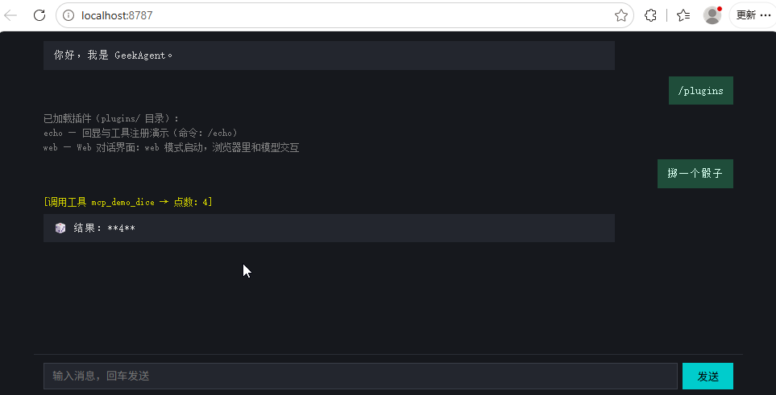

# Day 16：插件框架——plugins/ 目录即插即用

> Day 15 已经能动态发现 MCP 工具，但 Skills、RAG、MCP 的启动和清理仍由主程序逐项接线。今天补一层插件约定：主程序只负责发现和调度，扩展能力自己声明命令、工具和生命周期。

## 0. 插件和之前的能力有什么区别？

从 Day 11 开始，我们陆续引入了技能（Skills）、MCP 工具、RAG 知识库，每项能力都对应一个独立的模块文件。但它们和"插件"有什么不同？

| 对比项 | 技能 / MCP / RAG | 插件 |
|---|---|---|
| 加载方式 | 主程序显式 import 和调用 | 扫描 plugins/ 目录，自动动态加载 |
| 注册能力 | 直接调用 `registerTool` | 通过 `onStart` 钩子拿到上下文 |
| 能否起服务 | 不能，所有代码在主进程内 | 可以，`onStart` 里随意建 HTTP 服务 |
| 能否独立演进 | 修改后要同步调整主程序接线 | 只要 SDK 契约不变，就能单独修改目录内容 |
| 失败影响 | 代码写错会导致主程序崩溃 | 加载失败或钩子抛错，只回滚该插件 |
| 与主程序耦合 | 紧密——import 关系明确 | 松散——只依赖 SDK 接口 |

技能按任务组织指令和工具，MCP 用协议连接外部进程，RAG 管理可检索的资料。插件不替代它们，它解决的是另一层问题：一组代码怎样被主程序发现，怎样拿到运行环境，又怎样在退出时释放资源。

插件也不等于"只能注册工具"。它还能注册命令（如 echo 插件的 `/echo`）和启动服务（web 插件在端口 8787 起 HTTP 服务）。工具注册只是 `onStart` 里可以做的事情之一。

## 1. 为什么：每个新功能都要改主程序

前 15 天每新增一项能力，我们都要打开 `index.ts`：增加 import 和初始化调用，再给 `handleCommand` 加一个 case。能力本身虽然已经分文件，接线仍集中在入口里。

把能力从主程序抽出来，做成独立模块，带来几个直接的好处：

- **入口稳定**。新增插件只增加一个目录，不再为它增加 import、初始化调用和命令 case。
- **失败隔离**。某个插件加载或启动失败时，框架记录错误并回滚它注册的命令和工具，其他插件继续启动。
- **生命周期统一**。插件在 `onStart` 获取依赖，在 `onExit` 释放 HTTP server 等资源，主程序只负责按顺序调用。

这不是把所有旧模块都改造成插件。Day 16 先建立最小契约，并用 echo 和 web 两个目录验证命令、工具与服务三类扩展点。

## 2. 目标

1. 启动时扫描 `plugins/*/plugin.ts`：合法插件进入列表，插件命令可以直接通过 `/命令` 执行；
2. `onStart` 可以注册模型工具或启动服务；启动失败时只回滚当前插件，其他插件仍然可用；
3. 以 `web` 服务模式启动时，浏览器消息复用主程序已有的命令分发、记忆召回和工具循环，并通过 SSE 返回流式结果。

**当天代码行数**：相对 Day 15，源码新增 420 行、删除 9 行，净增 411 行；其中 `plugins/web/index.html`（73 行）是浏览器端聊天页面，`tui.ts` 与 Day 15 完全一致。

## 3. 设计：插件 = 目录 + plugin.ts

### 3.1 插件可以放在哪里运行

成熟系统里的插件大致有三种形态：

| 方案 | 怎样接入 | 隔离能力 | 主要成本 | 适用场景 |
|---|---|---|---|---|
| 编译期扩展 | 主程序直接 import 模块 | 无 | 每次新增都改入口 | 内置且稳定的能力 |
| 进程内插件 | 运行时发现并加载模块 | 只能隔离生命周期错误 | 插件拥有主进程权限 | 本机、小规模扩展 |
| 进程外插件 | 子进程或远程服务，通过协议通信 | 可限制进程权限和故障范围 | 协议、序列化与部署更复杂 | 第三方或不可信扩展 |

VS Code 扩展使用单独的 extension host，浏览器扩展依赖受限 API 和权限声明，MCP server 则通过进程或网络边界提供能力。这些方案都比直接加载模块更容易控制故障和权限，但实现成本也更高。

今天选择进程内插件：扫描目录后动态 `import`，再用 TypeScript 接口约定形状。它适合我们这个本机 demo，也能用较少代码讲清发现、依赖注入和生命周期。代价同样明确：插件代码与 Agent 权限相同，模块顶层代码造成的副作用无法回滚，所以它不是安全沙箱。

### 3.2 三种能力

一个插件目录的基本结构：

```
plugins/echo/
  plugin.ts         # 必须：导出 Plugin 对象
```

Plugin 接口定义了三段可选能力：

```ts
interface Plugin {
    name: string;
    description: string;
    commands?: PluginCommand[];        // 注册为 /命令
    onStart?: (ctx: PluginContext) => void;  // 启动时执行
    onExit?: (ctx: PluginContext) => void;   // 退出前执行
}
```

`commands` 是最轻量的能力——注册一条命令，用户输入 `/命令` 时执行处理函数。`onStart` 获得完整的上下文，可以注册工具、启动后台服务、读取插件自己的配置文件。`onExit` 负责清理：关闭 HTTP 服务、断开连接等。

### 3.3 依赖方向：由主程序注入

插件需要访问主程序的输出、对话入口和工具注册器。如果插件直接 import 主程序入口 `index.ts`，加载方向就会首尾相接，模块初始化顺序也会变得难以判断。

我们的做法是反过来：主程序把所有插件需要的东西打包成 `PluginContext`，通过 `onStart` 的参数注入给插件。插件只需要 import `plugin-sdk.js`，不需要关心主程序的内部模块路径。

```ts
interface PluginContext {
    tui: Pick<TUI, 'append' | 'appendInline'>;  // 插件实际使用的输出接口
    mode: 'tui' | 'web';  // 运行模式
    registerTool(tool: Tool): void;        // 注册工具（出错时自动回滚）
    reply(line: string): Promise<void>;    // 对话处理函数
    handleCommand(line: string): Promise<void>;  // 命令处理函数
}
```

这种设计限制了耦合面：插件拿不到主程序的 `Chat`、模型配置、权限根目录和会话状态，也不需要知道命令怎样分发、面板怎样更新。它约束的是代码依赖，不是权限边界。

### 3.4 服务模式：复用同一条对话链路

普通 TUI 模式需要真实终端。命令行参数为 `web` 时，主程序跳过 TUI 初始化，改用一套 headless 实现：

```ts
const tui = webMode ? createHeadlessTui() : new TUI(onLine, onExit);
```

headless 实现放在新增的 `plugin.ts` 中：`append` 默认写到终端，其余界面方法保留同名空实现，原有 `tui.ts` 不需要修改。web 插件在请求处理时把 `append` 替换成 SSE 写入函数，这样 `reply` 和 `handleCommand` 的输出就能流到浏览器。`confirm` 返回 true，意味着服务模式下所有需要确认的操作用户都看不到提示就直接放行（这是 demo 的简化，不是最终方案）。

### 3.5 加载与生命周期

主程序在启动时依次执行：

1. 扫描 `plugins/` 目录，对每个子目录 `import('./plugins/<name>/plugin.ts')`；
2. 把 `commands` 注册进命令表；
3. 调用每个插件的 `onStart(ctx)`，把上下文传进去；
4. 退出前调用每个插件的 `onExit(ctx)`。

| 阶段 | 主程序做的事 | 插件做的事 |
|---|---|---|
| 加载 | 扫描目录、动态 import | 无（只导出 Plugin 对象） |
| 启动 | 逐个调用 onStart，失败则回滚 | 注册命令、注册工具、起服务 |
| 运行 | 命中外层 switch 未匹配的 /命令时，委托给插件命令表 | 处理命令、处理请求 |
| 退出 | 逐个调用 onExit，失败只记录 | 关闭服务、释放资源 |

`onStart` 失败时，框架回滚通过上下文注册的命令和工具，不影响其他插件继续启动；目标服务插件失败时，服务模式直接退出。`onExit` 失败只记录错误，不阻塞退出流程。动态 import 时已经执行的模块顶层副作用不在回滚范围内，因此这里只称为生命周期隔离。

## 4. 实现：先效果，后实现

### 4.1 先看效果

TUI 模式下，`/plugins` 展示已加载的插件和它们的命令：

<pre style="background:#1e1e1e;color:#d4d4d4;padding:8px;border-radius:4px">
<span style="color:#808080">[echo 插件] 已加载</span>
<span style="color:#808080">[web 插件] 已加载</span>
<span style="color:#808080">GeekAgent Day 16 —— 插件框架</span>
<span style="color:#808080">plugins/ 目录下的插件已自动加载：/plugins 查看，插件命令可直接使用（如 /echo hello）。</span>
<span style="color:#00cdcd">You › /plugins</span>
<span style="color:#808080">已加载插件（plugins/ 目录）：</span>
<span style="color:#808080">echo — 回显与工具注册演示（命令：/echo）</span>
<span style="color:#808080">web — Web 对话界面：web 模式启动，浏览器里和模型交互</span>
<span style="color:#00cdcd">You › /echo hello</span>
<span style="color:#808080">回声：hello</span>
</pre>

启动 web 服务模式时，终端会直接打印对话界面的地址：

<pre style="background:#1e1e1e;color:#d4d4d4;padding:8px;border-radius:4px">
<span style="color:#808080">$ npm run dev -- day16/index.ts web</span>
<span style="color:#808080">[echo 插件] 已加载</span>
<span style="color:#808080">[web 插件] 对话界面已启动：http://localhost:8787</span>
<span style="color:#808080">[web 插件] 已加载</span>
</pre>

打开这个地址，就可以在浏览器里执行命令、对话和调用工具：



### 4.2 plugin-sdk.ts：插件唯一需要 import 的文件（完整 7 行）

```ts
// day16/plugin-sdk.ts
/**
 * 插件 SDK —— 插件可调用的接口全在此处导出。
 * 插件只需 `import { … } from '../../plugin-sdk.js'`，无需关心内部模块路径。
 */
export type { Plugin, PluginContext } from './plugin.js';
export type { Tool } from './tools.js';
```

这一层只暴露插件契约和工具类型。注册动作必须经过 `PluginContext`，框架才能记录资源归属，并在插件启动失败时准确回滚。

### 4.3 plugin.ts：插件框架本体（完整 161 行）

```ts
// day16/plugin.ts
import { readdir } from 'node:fs/promises';
import { dirname, join, resolve } from 'node:path';
import { fileURLToPath, pathToFileURL } from 'node:url';
import type { Color, TUI } from './tui.js';
import { registerTool as registerToolGlobal, unregisterTool as unregisterToolGlobal, type Tool } from './tools.js';

export interface PluginCommand {
    /** 命令名（不含 `/`），如 `echo` 对应 `/echo`。 */
    name: string;
    description: string;
    /** 处理函数：接收命令后的整段参数，返回要展示给用户的文本。 */
    handler: (args: string) => Promise<string> | string;
}

/** 注入给插件钩子的运行时上下文。 */
export interface PluginContext {
    tui: Pick<TUI, 'append' | 'appendInline'>;
    /** 主入口（index.ts）导出的对话处理函数：普通消息走 reply，斜杠命令走 handleCommand。服务插件（web 等）按需调用。 */
    reply: (line: string) => Promise<void>;
    handleCommand: (line: string) => Promise<void>;
    /** 运行模式：'tui' = 终端界面，'web' = Web 对话界面。 */
    mode: 'tui' | 'web';
    /** 注册工具并计入本插件账上：onStart 失败时自动回滚该插件注册的工具。 */
    registerTool(tool: Tool): void;
}

/** 主程序提供的公共上下文；registerTool 由框架按插件注入。 */
export type PluginBaseContext = Omit<PluginContext, 'registerTool'>;

/** 服务模式不创建真实终端，只保留主程序会调用的同名方法。 */
export function createHeadlessTui() {
    const noop = () => {};
    return {
        start: noop,
        stop: noop,
        append: (text: string, _color: Color) => console.log(text),
        appendInline: (text: string, _color: Color) => process.stdout.write(text),
        setPanel: (_lines: string[]) => {},
        setBusy: (_busy: boolean) => {},
        ready: noop,
        confirm: async (_prompt: string) => true,
    };
}
/**
 * 插件 = 一个 plugins/<name>/ 目录，目录里的 plugin.ts 导出此接口。
 * 三种能力：commands 在加载时注册（进命令表）；onStart/onExit 拿到 ctx，
 * 可以在里面起 HTTP 服务、注册工具。
 */
export interface Plugin {
    name: string;
    description: string;
    commands?: PluginCommand[];
    onStart?: (ctx: PluginContext) => Promise<void> | void;
    onExit?: (ctx: PluginContext) => Promise<void> | void;
}

const PLUGINS_DIR = resolve(dirname(fileURLToPath(import.meta.url)), 'plugins');

let plugins: Plugin[] = [];
/** 命令注册表：插件命令全量进表，内置命令优先级高于插件命令。 */
const commands = new Map<string, PluginCommand>();
/** 每个插件注册的工具名，onStart 失败时按此回滚。 */
const ownedTools = new Map<Plugin, string[]>();

/** 执行插件命令：返回展示文本；命令不存在返回 null。 */
export async function execPluginCommand(name: string, args: string): Promise<string | null> {
    const cmd = commands.get(name);
    if (!cmd) return null;
    return await cmd.handler(args);
}

/** 列出已注册的插件命令（供 /help 和 /plugins 展示）。 */
export function listPluginCommands(): readonly PluginCommand[] {
    return [...commands.values()];
}
/** 扫描 plugins/ 目录：每个子目录一个插件，动态 import 其中的 plugin.ts；加载失败的插件跳过。 */
export async function loadPlugins(): Promise<Plugin[]> {
    plugins = [];
    commands.clear();
    ownedTools.clear();
    let entries;
    try {
        entries = await readdir(PLUGINS_DIR, { withFileTypes: true });
    } catch (err) {
        if ((err as NodeJS.ErrnoException).code === 'ENOENT') return plugins;
        throw err;
    }
    for (const entry of entries) {
        if (!entry.isDirectory()) continue;
        const dir = join(PLUGINS_DIR, entry.name);
        try {
            const mod = await import(pathToFileURL(join(dir, 'plugin.ts')).href);
            const plugin = mod.default as Plugin;
            if (!plugin?.name) throw new Error('plugin.ts 未导出 default Plugin 对象');
            if (plugins.some((item) => item.name === plugin.name)) throw new Error(`插件名 ${plugin.name} 已注册`);
            const seen = new Set<string>();
            const duplicate = (plugin.commands ?? []).find((cmd) => {
                if (commands.has(cmd.name) || seen.has(cmd.name)) return true;
                seen.add(cmd.name);
                return false;
            });
            if (duplicate) throw new Error(`插件命令 /${duplicate.name} 已注册`);
            for (const cmd of plugin.commands ?? []) commands.set(cmd.name, cmd);
            plugins.push(plugin);
        } catch (err) {
            console.error(`插件 ${entry.name} 加载失败：${(err as Error).message}`);
        }
    }
    return plugins;
}
export function listPlugins(): readonly Plugin[] {
    return plugins;
}

/** 为该插件构建带账本的上下文：registerTool 记录到回滚清单。 */
function contextFor(base: PluginBaseContext, p: Plugin): PluginContext {
    return {
        ...base,
        registerTool: (tool: Tool) => {
            registerToolGlobal(tool);
            const list = ownedTools.get(p) ?? [];
            list.push(tool.name);
            ownedTools.set(p, list);
        },
    };
}
/** 依次执行所有插件的启动钩子；某个插件抛错就回滚它的命令与工具，不阻断其余插件。 */
export async function runPluginStart(base: PluginBaseContext): Promise<readonly string[]> {
    const failed: string[] = [];
    const failedPlugins = new Set<Plugin>();
    for (const p of plugins) {
        try {
            await p.onStart?.(contextFor(base, p));
            base.tui.append(`[${p.name} 插件] 已加载`, 'sys');
        } catch (err) {
            for (const cmd of p.commands ?? []) commands.delete(cmd.name);
            for (const name of ownedTools.get(p) ?? []) unregisterToolGlobal(name);
            failed.push(p.name);
            failedPlugins.add(p);
            console.error(`插件 ${p.name} onStart 失败，已回滚：${(err as Error).message}`);
        }
    }
    plugins = plugins.filter((p) => !failedPlugins.has(p));
    return failed;
}

/** 退出钩子：同样逐个执行、隔离失败。 */
export async function runPluginExit(base: PluginBaseContext): Promise<void> {
    for (const p of plugins) {
        try {
            await p.onExit?.(contextFor(base, p));
        } catch (err) {
            console.error(`插件 ${p.name} onExit 失败：${(err as Error).message}`);
        }
    }
}
```

这份框架按加载顺序完成三件事。

**先发现并校验。** `loadPlugins` 动态 import 每个插件，拒绝重复的插件名和命令名。加载错误只记录当前目录，不中断后续扫描。

**再注入依赖。** `contextFor` 为每个插件补上带归属记录的 `registerTool`。`reply` 与 `handleCommand` 从主程序传入，web 插件因此复用已有的对话链路。

**最后管理生命周期。** `runPluginStart` 逐个启动插件，成功后统一打印已加载，失败时删除它的命令和工具，并返回失败名单。TUI 模式继续运行，服务模式发现目标插件失败则退出。`runPluginExit` 隔离每个退出钩子的错误，确保其他插件仍有机会清理。

### 4.4 plugins/echo/plugin.ts：最简插件（完整 26 行）

```ts
// day16/plugins/echo/plugin.ts
import type { Plugin, Tool } from '../../plugin-sdk.js';

const plugin: Plugin = {
    name: 'echo',
    description: '回显与工具注册演示',
    commands: [
        {
            name: 'echo',
            description: '回显文本（/echo <内容>）',
            handler: (args: string) => `回声：${args || '（空）'}`,
        },
    ],
    onStart: async (ctx) => {
        ctx.registerTool(echoTool);
    },
};

export default plugin;

const echoTool: Tool = {
    name: 'echo_repeat',
    description: '重复输入文本，用于测试工具调用',
    parameters: { type: 'object', properties: { text: { type: 'string' } }, required: ['text'] },
    run: (args: { text: string }) => `重复：${args.text}`,
};
```

echo 插件演示了命令（`/echo`）和工具（`echo_repeat`）两种扩展点。它不需要自己打印启动通知；框架在 `onStart` 成功后统一输出。`plugin.ts` 使用 `import type { Plugin, Tool }` 从 SDK 导入类型，不需要关心主程序内部模块。

### 4.5 plugins/web/plugin.ts：Web 对话界面（完整 97 行）

```ts
// day16/plugins/web/plugin.ts
import { readFile } from 'node:fs/promises';
import { createServer, type Server, type ServerResponse } from 'node:http';
import { dirname, join } from 'node:path';
import { fileURLToPath } from 'node:url';
import type { Plugin, PluginContext } from '../../plugin-sdk.js';

const ROOT = dirname(fileURLToPath(import.meta.url));
const PORT = 8787;

let server: Server | null = null;
let chatting = false;

async function readChatHtml(): Promise<string> {
    return await readFile(join(ROOT, 'index.html'), 'utf8');
}

/** 把全局 tui 的 append 接到当前请求的 SSE 流上，然后调用 reply 或 handleCommand。 */
async function handleChatSSE(ctx: PluginContext, message: string, res: ServerResponse): Promise<void> {
    const tui = ctx.tui;
    tui.append = (text, color) => {
        if (!text) return;
        const type = color === 'model' ? 'content' : color === 'sys' ? 'system' : 'tool';
        res.write(`data: ${JSON.stringify({ type, text })}\n\n`);
    };
    tui.appendInline = (text, color) => tui.append(text, color);
    try {
        if (message.startsWith('/')) await ctx.handleCommand(message);
        else await ctx.reply(message);
    } catch (e) {
        res.write(`data: ${JSON.stringify({ type: 'error', text: (e as Error).message })}\n\n`);
    } finally {
        chatting = false;
    }
    res.write('data: {"type":"done"}\n\n');
    res.end();
}
const plugin: Plugin = {
    name: 'web',
    description: 'Web 对话界面：web 模式启动，浏览器里和模型交互',
    onStart: async (ctx) => {
        if (ctx.mode !== 'web') return;
        const html = await readChatHtml();
        server = createServer((req, res) => {
            if (req.method === 'GET' && req.url === '/') {
                res.writeHead(200, { 'Content-Type': 'text/html; charset=utf-8' });
                res.end(html);
            } else if (req.method === 'GET' && req.url === '/status') {
                res.writeHead(200, { 'Content-Type': 'application/json' });
                res.end(JSON.stringify({ plugin: 'web', status: 'ok', port: PORT, at: new Date().toISOString() }));
            } else if (req.method === 'POST' && req.url === '/api/chat') {
                if (chatting) {
                    res.writeHead(409, { 'Content-Type': 'application/json' });
                    res.end('{"error":"chat is busy"}');
                    return;
                }
                let body = '';
                req.on('data', (c) => (body += c));
                req.on('end', () => {
                    try {
                        const { message } = JSON.parse(body);
                        if (typeof message !== 'string' || !message.trim()) {
                            res.writeHead(400);
                            res.end('{"error":"message required"}');
                            return;
                        }
                        res.writeHead(200, {
                            'Content-Type': 'text/event-stream',
                            'Cache-Control': 'no-cache',
                            Connection: 'keep-alive',
                        });
                        chatting = true;
                        void handleChatSSE(ctx, message, res);
                    } catch (e) {
                        if (!res.headersSent) res.writeHead(500);
                        res.end(String((e as Error).message));
                    }
                });
            } else {
                res.writeHead(404);
                res.end('not found');
            }
        });
        await new Promise<void>((resolve, reject) => {
            server!.once('error', reject);
            server!.listen(PORT, resolve);
        });
        ctx.tui.append(`[web 插件] 对话界面已启动：http://localhost:${PORT}`, 'sys');
    },
    onExit: async () => {
        if (server) await new Promise<void>((resolve) => server!.close(() => resolve()));
        server = null;
    },
};

export default plugin;
```

`onStart` 先检查运行模式：只有 web 模式才启动 HTTP 服务并打印访问地址，统一的已加载通知由框架输出。收到聊天请求后，`handleChatSSE` 临时把 headless 输出接到当前 SSE 响应，再调用注入的 `reply` 或 `handleCommand`。模型回复、工具进度和命令结果因此沿用同一套主程序逻辑。

服务模式下的 HTTP 服务有三个端点：

| 端点 | 方法 | 用途 |
|---|---|---|
| `/` | GET | 返回聊天页面（index.html） |
| `/status` | GET | 返回 JSON 状态 |
| `/api/chat` | POST | 接收消息，返回 SSE 流 |

`Chat` 和输出桩都是共享状态，因此服务端同时只接受一段对话；已有请求执行时，新请求返回 HTTP 409，避免两段流写进彼此的 SSE。`onExit` 等待 HTTP 服务真正关闭，再把 `server` 置成 null。

### 4.6 plugins/web/index.html：浏览器端

```html
<!DOCTYPE html>
<html lang="zh">
<head>
<meta charset="UTF-8">
<meta name="viewport" content="width=device-width, initial-scale=1.0">
<title>GeekAgent Day 16</title>
<style>
body { margin: 0; background: #16181d; color: #d4d4d4; display: flex; flex-direction: column; height: 100vh; font: 13px/1.5 monospace; }
#chat { width: 100%; max-width: 880px; box-sizing: border-box; align-self: center; flex: 1; overflow-y: auto; padding: 12px; display: flex; flex-direction: column; }
.bubble { max-width: 80%; padding: 8px 12px; margin: 0 0 8px; white-space: pre-wrap; }
.user { background: #1f4d3a; color: #d7fff0; align-self: flex-end; }
.assistant { background: #23262e; }
.tool { color: #cdcd00; font-size: 12px; margin: 0 0 6px; }
.system { color: #808080; font-size: 12px; margin: 0 0 6px; white-space: pre-wrap; }
.error { color: #cd5c5c; font-size: 12px; margin: 0 0 6px; }
#bar { width: 100%; max-width: 880px; box-sizing: border-box; align-self: center; display: flex; gap: 6px; padding: 10px 12px; border-top: 1px solid #2a2d36; }
#inp { flex: 1; background: #23262e; border: 1px solid #3a3e48; color: #e8e8e8; padding: 8px 10px; }
#btn { background: #0cc; color: #000; border: 0; padding: 0 18px; }
#btn:disabled { background: #3a3e48; color: #808080; }
</style>
</head>
<body>
<div id="chat"></div>
<div id="bar">
  <input id="inp" placeholder="输入消息，回车发送" autocomplete="off">
  <button id="btn">发送</button>
</div>
<script>
const chat = document.getElementById('chat'), inp = document.getElementById('inp'), btn = document.getElementById('btn');
let busy = false;
function add(c, t) { const e = document.createElement('div'); e.className = c; e.textContent = t; chat.appendChild(e); chat.scrollTop = chat.scrollHeight; return e; }
async function send() {
  if (busy) return;
  const msg = inp.value.trim();
  if (!msg) return;
  inp.value = ''; add('bubble user', msg);
  busy = true; btn.disabled = true;
  let cur = null;
  try {
    const resp = await fetch('/api/chat', { method: 'POST', headers: { 'Content-Type': 'application/json' }, body: JSON.stringify({ message: msg }) });
    if (!resp.ok || !resp.body) throw new Error('HTTP ' + resp.status);
    const reader = resp.body.getReader();
    const dec = new TextDecoder();
    let buf = '';
    for (;;) {
      const { done, value } = await reader.read();
      if (done) break;
      buf += dec.decode(value, { stream: true });
      let idx;
      while ((idx = buf.indexOf('\n\n')) >= 0) {
        const line = buf.slice(0, idx).trim();
        buf = buf.slice(idx + 2);
        if (!line.startsWith('data: ')) continue;
        const evt = JSON.parse(line.slice(6));
        if (evt.type === 'content') {
          if (!cur) cur = add('bubble assistant', '');
          cur.textContent += evt.text;
        } else if (evt.type === 'tool') { add('tool', evt.text.trim()); }
        else if (evt.type === 'system') { add('system', evt.text); }
        else if (evt.type === 'error') { add('error', evt.text); }
        else if (evt.type === 'done') { cur = null; }
      }
    }
  } catch (e) { add('error', e.message); }
  busy = false; btn.disabled = false; inp.focus();
}
inp.addEventListener('keydown', (e) => { if (e.key === 'Enter') send(); });
btn.addEventListener('click', send);
add('bubble assistant', '你好，我是 GeekAgent。');
inp.focus();
</script>
</body>
</html>
```

浏览器端使用 `fetch` + `ReadableStream` 读取 SSE 流，按 `data: ` 前缀切分事件，每个事件有 `type` 字段：

| type | 含义 | 前端行为 |
|---|---|---|
| `content` | 模型回复文本 | 追加到当前气泡 |
| `tool` | 工具调用日志 | 新建黄色文本行 |
| `system` | 命令结果或系统消息 | 新建灰色文本行 |
| `error` | 请求错误 | 新建红色行 |
| `done` | 流结束 | 准备下一轮回复 |

### 4.7 index.ts：主程序的改动

主程序 `index.ts` 围绕插件框架做了几处改动，这里只贴新增的部分，完整代码见仓库。

**引入插件模块**（`day16/index.ts:18`）：

```ts
import { createHeadlessTui, execPluginCommand, listPluginCommands, listPlugins, loadPlugins, runPluginExit, runPluginStart, type PluginBaseContext } from './plugin.js';
```

**服务模式判断**（`day16/index.ts:26`）：

```ts
const mode = process.argv[2] ?? 'tui';
if (mode !== 'tui' && mode !== 'web') {
    console.error(`未知启动模式：${mode}（可选：web）`);
    process.exit(1);
}
const webMode = mode === 'web';

if (!webMode && (!process.stdin.isTTY || !process.stdout.isTTY)) {
    console.error('Day 11 的 TUI 需要真实终端（TTY）；管道 / 重定向下请运行 day6。');
    process.exit(1);
}
```

`argv[2]` 只接受 `web`；其他值直接报错，避免让不启动服务的插件进入永久等待。

**选择终端实现**：

```ts
const tui = webMode ? createHeadlessTui() : new TUI(onLine, onExit);
```

**加载插件与启动钩子**（`day16/index.ts:82`）：

```ts
const plugins = await loadPlugins();
const pluginCtx: PluginBaseContext = { tui, mode, reply, handleCommand };
const failedPlugins = await runPluginStart(pluginCtx);
if (webMode && failedPlugins.includes('web')) process.exit(1);
```

`reply` 和 `handleCommand` 仍是 `index.ts` 内部函数，只通过 `PluginContext` 注入给插件，不增加新的模块导出。

**/plugins 命令**（`day16/index.ts:258`）：

```ts
case '/plugins': {
    if (plugins.length === 0) {
        tui.append('（plugins/ 目录下暂无插件）', 'sys');
        break;
    }
    const pluginLines = plugins.map((p) => {
        const cmds = (p.commands ?? []).map((c) => `/${c.name}`).join('、');
        return `${p.name} — ${p.description}${cmds ? `（命令：${cmds}）` : ''}`;
    });
    tui.append(`已加载插件（plugins/ 目录）：\n${pluginLines.join('\n')}`, 'sys');
    break;
}
```

**default 分支委托插件命令**（`day16/index.ts:324`）：

```ts
default: {
    if (command.startsWith('/')) {
        const cmdName = command.slice(1);
        const args = line.slice(command.length).trim();
        const result = await execPluginCommand(cmdName, args);
        if (result !== null) {
            tui.append(result, 'sys');
            break;
        }
    }
    tui.append(`未知命令：${command}（输入 /help 查看）`, 'sys');
}
```

内置命令的 `switch case` 优先匹配，匹配不上时交给插件命令表。先匹配内置再匹配插件，确保内置命令不能被插件覆盖。

**退出前通知插件**（`day16/index.ts:378`）：

```ts
async function onExit(): Promise<void> {
    stopMcpServers(); // 关掉 MCP server 子进程
    await runPluginExit(pluginCtx); // 退出前通知插件
```

**末尾分流**（`day16/index.ts:394`）：

```ts
if (webMode) {
    process.once('SIGINT', () => void onExit());
    process.once('SIGTERM', () => void onExit());
    await new Promise(() => {});
} else {
    tui.start();
    updatePanel();
    tui.append('GeekAgent Day 16 —— 插件框架', 'sys');
    tui.append('plugins/ 目录下的插件已自动加载：/plugins 查看，插件命令可直接使用（如 /echo hello）。', 'sys');
}
```

服务模式用 `await new Promise(() => {})` 挂住进程；收到 Ctrl+C 或 SIGTERM 后，先执行所有退出钩子，再结束进程。TUI 模式正常启动界面。

### 4.8 tui.ts：保持不变

插件只通过 `Pick<TUI, 'append' | 'appendInline'>` 描述自己依赖的两个输出方法，服务模式的空实现在 `plugin.ts` 中提供。因此 `tui.ts` 与 Day 15 逐字一致，插件能力没有侵入终端实现。

## 5. 验证

```bash
npm run typecheck
npm run dev -- day16/index.ts
```

1. 启动后输入 `/echo hello`，输出 `回声：hello`；
2. 输入 `/plugins`，显示 echo 和 web 两个插件，其中 echo 带有 `/echo` 命令；
3. 按 Ctrl+C 退出，检查确认退出前保存了会话。

服务模式验证：

```bash
npm run dev -- day16/index.ts web
```

```bash
# 另一个终端
curl -s http://localhost:8787/status
# → {"plugin":"web","status":"ok","port":8787,"at":"2026-09-03T10:54:19.049Z"}

curl -s -X POST http://localhost:8787/api/chat \
  -H 'Content-Type: application/json' \
  -d '{"message":"/plugins"}'
# → SSE 流，包含 echo 和 web 两个插件的信息

curl -s -o /dev/null -w "%{http_code}" http://localhost:8787/
# → 200（首页正常返回）
```

## 6. 没做什么

- 插件不能热加载或热卸载，增减插件需要重启 Agent；
- 插件仍共享主进程，没有依赖声明、资源协调和独立的权限或故障边界；
- Web 模式没有远程确认，对话历史和断线重连等交互能力也未实现。

## 7. 下一步

现在，新增本地能力已经有了统一入口，但插件仍与主进程共享权限和故障范围。下一步可以继续研究更清晰的运行边界：让扩展通过受控接口与 Agent 协作，同时保留今天建立的发现和生命周期模型。
